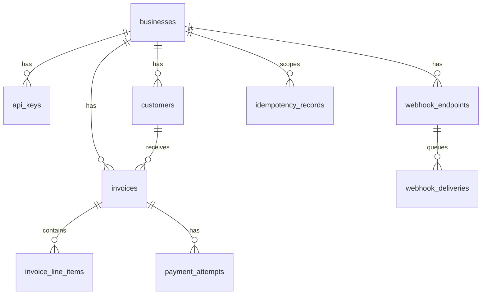
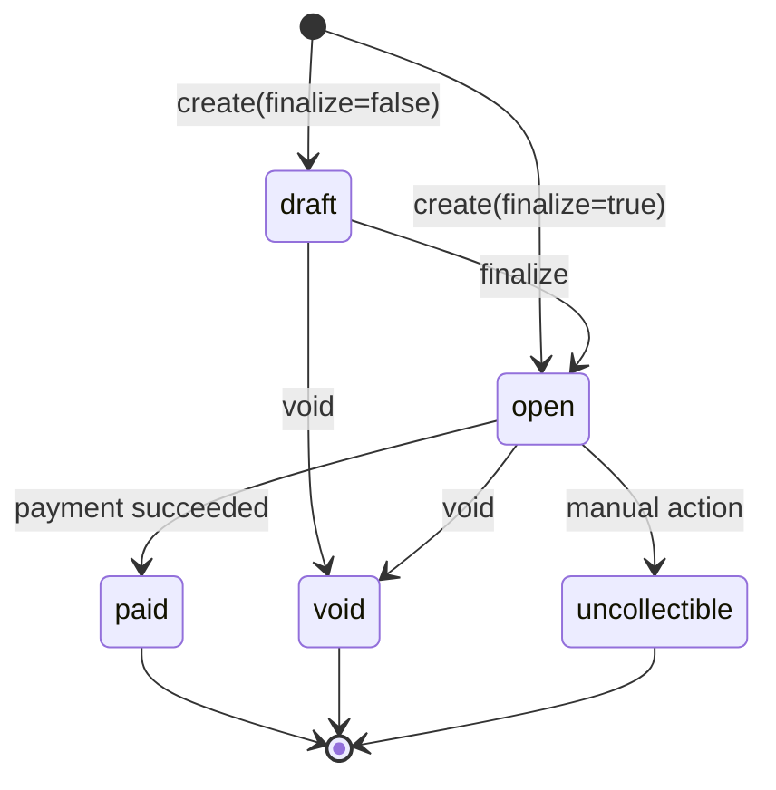

Applologies for drafting it this long, but it is very readble. I have made everything in bullet points or direct to point way, so you can easily skim through the document.

---

# Invoice & Payment Service – Design Document

## Overview

This project implements a minimal invoice and payment service using Rust(Axum), PostgreSQL, and a mock payment service provider(PSP). The focus of the implementation is correctness around money handling, invoice state transitions, idempotency, concurrency control, and webhook delivery.

The system is designed keeping the assignment docuemnt in mind so it will be a little slim and avoids features that are not required by the assignment such as refunds, subscriptions, or multi-currency support.

---

# 1. Data Model

## ER Diagram



## Tables

| Table               | Purpose                                       |
| ------------------- | --------------------------------------------- |
| businesses          | Root tenant entity                            |
| api_keys            | Authentication credentials for businesses     |
| customers           | Customer records scoped to a business         |
| invoices            | Invoice header information                    |
| invoice_line_items  | Individual invoice lines                      |
| payment_attempts    | Every payment attempt made against an invoice |
| idempotency_records | Cached responses for idempotent requests      |
| webhook_endpoints   | Registered webhook URLs                       |
| webhook_deliveries  | Outbox queue for webhook retries              |

## Primary Key Strategy

All tables use UUID primary keys.

I chose UUIDs rather than auto-incrementing integers because they avoid predictable identifiers being exposed through the API and allow future service decomposition without centralized ID generation.

## Indexes

* `api_keys(key_prefix)` for fast API key lookup
* `customers(business_id, email)` unique
* `invoices(business_id, state)`
* `payment_attempts(invoice_id)`
* `webhook_deliveries(status, next_retry_at)`

## Database Design Considerations

PostgreSQL was required by the assignment and is a strong fit for payment-related systems because it provides:

* Transactions
* Row-level locking
* Strong consistency guarantees
* Constraints and indexing

The application uses the `postgres:16-alpine` Docker image. PostgreSQL 16 provides current features and support, while the Alpine image keeps container size smaller, resulting in faster image pulls and startup times during development and evaluation.

## Why This Shape

Invoice line items are stored separately from invoices so totals remain auditable and can always be recomputed.

Payment attempts are append-only records rather than updating a single payment row. This preserves payment history and simplifies debugging.

Idempotency records and webhook deliveries are separated from invoices because they represent operational concerns rather than invoice data.

## At 100× Scale

If traffic increased significantly, I would:

* Partition webhook deliveries by date
* Move idempotency caching to Redis with TTL
* Add read replicas for list endpoints
* Introduce queue-based webhook processing
* Consider partitioning large invoice tables by business

---

# 2. Invoice State Machine

## State Diagram



## State Definitions

### Draft

Invoice exists but is not payable.

### Open

Invoice is finalized and can be paid.

### Paid

Payment completed successfully.

### Void

Invoice has been cancelled.

### Uncollectible

Invoice is no longer expected to be paid.

## Terminal States

The following states are terminal:

* paid
* void
* uncollectible

No further transitions are allowed once an invoice enters one of these states.

## Valid Transitions

| From  | To            | Trigger            |
| ----- | ------------- | ------------------ |
| draft | open          | finalize           |
| draft | void          | void               |
| open  | paid          | successful payment |
| open  | void          | void               |
| open  | uncollectible | manual action      |

## Invalid Transitions

Invalid transitions return:

```json
{
  "error": {
    "code": "invalid_state",
    "message": "..."
  }
}
```

with HTTP 409 Conflict.

I intentionally kept the state machine small because the assignment does not require dunning, retries, partial payments, or refunds.

---

# 3. Payment Correctness & Failure Modes

The payment flow is the most critical part of the system.

To prevent double charging, I use PostgreSQL row-level locking through:

```sql
SELECT ... FOR UPDATE
```

on the invoice row.

This guarantees that only one transaction can actively process payment for a given invoice at a time.

## (a) Two Simultaneous POST /pay Requests

Both requests attempt to acquire the invoice lock.

The first request:

1. Acquires the lock
2. Creates a pending payment attempt
3. Commits
4. Calls the PSP

The second request waits.

When the second request acquires the lock, it sees either:

* a pending payment attempt
* or a paid invoice

and returns HTTP 409 Conflict.

Outcome:

* At most one successful charge
* Invoice becomes paid only once
* No duplicate payment attempts

## (b) PSP Timeout (`tok_timeout`)

The mock PSP intentionally waits 30 seconds.

The invoice service uses a 5-second HTTP timeout.

When the timeout occurs:

* Payment attempt remains `pending`
* Invoice remains `open`
* API returns HTTP 202 Accepted

A background task continues processing the PSP call.

If the PSP eventually succeeds:

* payment attempt → succeeded
* invoice → paid

This prevents users from waiting 30 seconds for an API response while preserving correctness.

## (c) PSP Success Then Service Crash

The PSP could theoretically succeed and the application could crash before persistence completes.

The mock PSP does not support PSP-side idempotency.

In a production system I would send an idempotency key to the PSP and reconcile based on PSP references.

For this assignment, retries may require reconciliation using stored PSP references.

## (d) Idempotency Key Reused With Different Body

The request body is SHA-256 hashed.

If:

* same path
* same idempotency key
* different request body

the request is rejected with HTTP 409 Conflict.

If:

* same path
* same key
* same body

the previously cached response is returned.

No additional PSP call occurs.

## (e) POST /pay On A Paid Invoice

Returns:

```http
409 Conflict
```

No payment attempt is created and no PSP call is made.

## Why Row Locks?

I considered advisory locks and serializable transactions.

I chose row-level locking because:

* Simpler to reason about
* Easy to demonstrate
* Contention exists only per invoice
* Avoids broader transaction conflicts

---

# 4. Webhook Design

Businesses can register webhook endpoints.

Supported events include:

* invoice.created
* invoice.paid
* invoice.payment_failed

## Webhook Signature Design

Each webhook is signed using HMAC-SHA256.

Signed payload:

```text
{timestamp}.{json_body}
```

Headers:

```text
X-Dodo-Signature
X-Dodo-Timestamp
X-Dodo-Event
```

The receiver can recompute the signature and compare it with the received value.

Including the timestamp helps mitigate replay attacks by allowing old requests to be rejected.

## Retry Policy

Retries occur at:

```text
1s
5s
30s
2m
10m
```

Maximum attempts: 5

Successful deliveries are marked `delivered`.

Failed deliveries eventually become `exhausted`.

## Why Decouple Delivery?

Webhook delivery should never block invoice creation or payment processing.

For this reason:

1. API inserts delivery record into an outbox table
2. Background worker polls the outbox
3. Worker performs webhook delivery

This keeps API latency predictable even when webhook receivers are slow.

---

# 5. API Key Model

## Generation

Keys are generated as:

```text
dodo_sk_<random>
```

## Storage

Keys are stored using bcrypt hashes.

A short prefix is stored separately to allow indexed lookup.

I chose bcrypt instead of a simple SHA-256 hash because API keys behave similarly to passwords. If the database were compromised, bcrypt significantly increases the cost of brute-force attacks.

## Transmission

Authentication uses:

```http
Authorization: Bearer <api_key>
```

Production deployments should require HTTPS.

## Revocation

Keys can be soft-revoked using a `revoked_at` column.

## Blast Radius

Each key belongs to a single business.

A leaked key only exposes that business's resources rather than the entire platform.

---

# 6. What I Cut And Why

I intentionally kept the implementation focused on the core requirements of the assignment. The following items would be valuable in a production system but were excluded to keep the scope focused on invoice creation, payment correctness, idempotency, and webhook delivery.

### Redis-backed Idempotency Cache
Idempotency records are stored in PostgreSQL instead of Redis. PostgreSQL is sufficient for the expected scale of this project. At a larger scale, I would likely move idempotency caching to Redis with TTLs to reduce database load and improve lookup performance.

### API Key Rotation
The database supports API key revocation, but I did not build endpoints or workflows for key rotation. The assignment only requires API-key authentication, so I focused on secure storage and validation of keys instead.

---

# 7. Production Readiness Gaps

If this were deployed tomorrow, the three biggest gaps would be:

## Observability

* Distributed tracing
* Metrics
* Alerting
* Dashboards

## Rate Limiting

Per-IP and per-API-key limits to prevent abuse and accidental loops.

## Audit Logging

An immutable audit trail for security-sensitive actions such as:

* invoice voiding
* API key revocation
* webhook configuration changes

Additional future improvements would include PSP-side idempotency support, secrets management, and webhook endpoint verification workflows.
