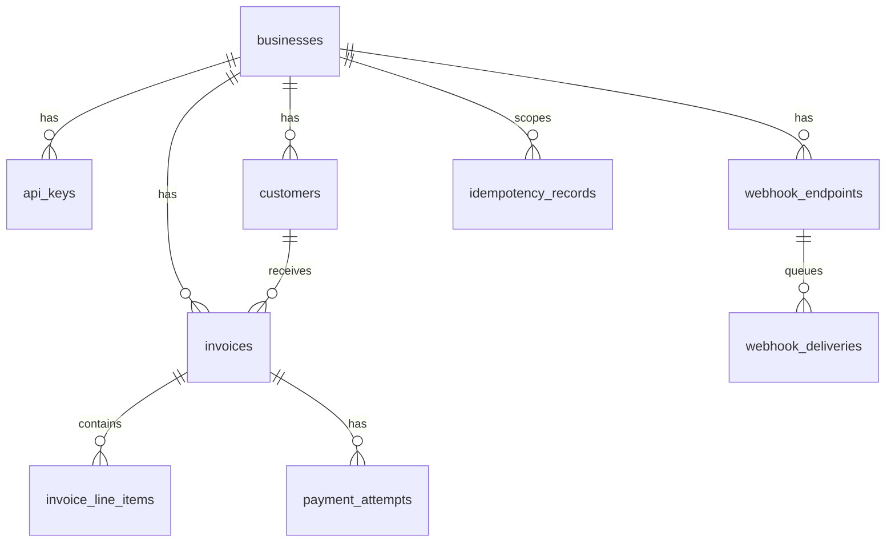
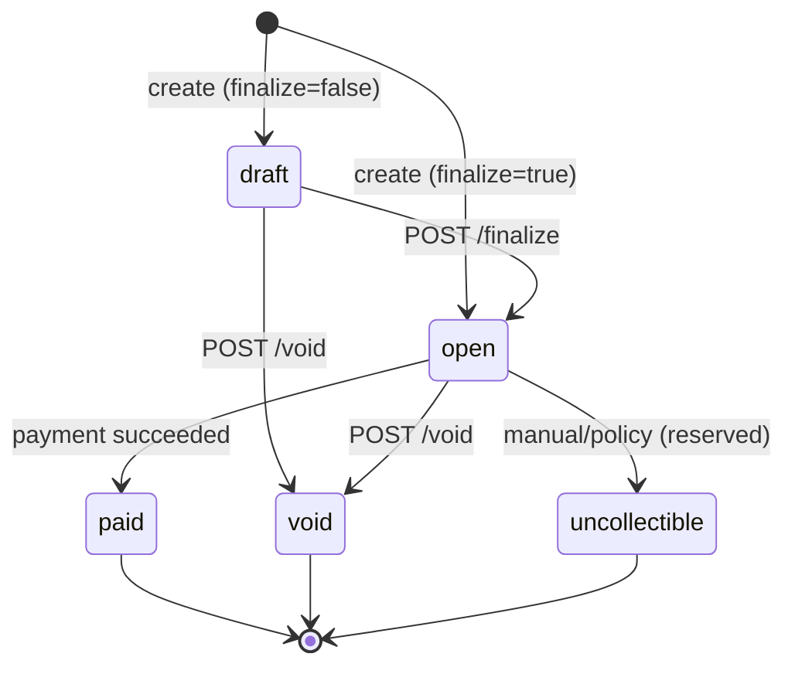

# Invoice & Payment Service - Design Document

## 1. Data Model

| Table | PK | Purpose |
|-------|-----|---------|
| `businesses` | UUID | Tenant root |
| `api_keys` | UUID | Hashed keys; `key_prefix` (12 chars) for lookup |
| `customers` | UUID | `(business_id, email)` unique |
| `invoices` | UUID | `invoice_state` enum, `total_cents` server-computed |
| `invoice_line_items` | UUID | quantity × unit_amount_cents; never client total |
| `payment_attempts` | UUID | `(invoice_id, idempotency_key)` unique |
| `idempotency_records` | UUID | Cached pay responses per `(business_id, idempotency_key, request_path)` |
| `webhook_endpoints` | UUID | Per-business URL + signing secret |
| `webhook_deliveries` | UUID | Outbox queue with retry schedule |

**Indexes:** `api_keys(key_prefix)` partial where not revoked; `invoices(business_id, state)`; pending webhooks on `(status, next_retry_at)`.

**Why this shape:** Normalized line items keep invoice totals auditable; payment attempts are append-only facts; idempotency and webhook delivery are separate tables so the hot pay path does not scan webhook history.

**At 100× scale:** Partition `webhook_deliveries` by month; move idempotency to Redis with TTL; add read replicas for list endpoints; consider `business_id` in all child tables for partition pruning.

---

## 2. Invoice State Machine

| Transition | Trigger | Reversible? |
|------------|---------|-------------|
| draft → open | finalize | No |
| draft/open → void | void API | No |
| open → paid | PSP success | No |
| open → uncollectible | future dunning | No |

**Terminal:** `paid`, `void`, `uncollectible`.

**Invalid transitions** (e.g. pay on `draft`, pay on `paid`) return HTTP 409 with `invalid_state` and a message naming both states. Enforcement is in `state_machine.rs` plus `SELECT … FOR UPDATE` in the pay handler.

---

## 3. Payment Correctness & Failure Modes

**Concurrency mechanism:** `SELECT … FOR UPDATE` on the invoice row inside a DB transaction, plus a guard that rejects new pays while a `pending` payment attempt exists. This serializes concurrent pay requests without serializable isolation on the whole DB.

### (a) Two simultaneous POST /pay

Both transactions queue on the invoice row lock. The first inserts a `pending` attempt and commits before calling the PSP. The second sees `pending` (or `paid` after success) and returns **409 Conflict** (`payment already in progress` or `already paid`). **Outcome:** at most one charge; invoice ends `paid` once.

### (b) PSP timeout (`tok_timeout`, 30s)

The HTTP client uses a **5s timeout**. On timeout the attempt stays **`pending`**, the API returns **202 Accepted** with the attempt id, and a background task calls the PSP with a 35s timeout. Invoice remains **`open`** until background success → **`paid`**. Callers reuse the same `Idempotency-Key` to get the cached 202/200 body without a second charge.

### (c) PSP success then crash before persist

Idempotency record is stored **after** PSP result is persisted. If we crash after PSP success but before commit, retry with the same key may call PSP again - **mock PSP is not idempotent**, so production would use PSP idempotency keys. Mitigation documented: store `pending` + PSP reference before calling, or use PSP keys; on retry, reconcile by `psp_ref` if attempt already succeeded.

### (d) Idempotency key reused with different body

Request body is SHA-256 hashed. Scope is **per invoice pay URL** (`/invoices/{id}/pay`), so the same `Idempotency-Key` on two different invoices is two independent requests. Mismatch on the same URL → **409 Conflict** (`idempotency key reused with different request body`). Same URL + same body → cached JSON response, no new attempt.

### (e) POST /pay on `paid` invoice

**409 Conflict** - `invoice is already paid`. No PSP call.

**Why not advisory locks / serializable?** Row lock is simpler, easy to reason about in tests, and sufficient for single-invoice contention. Serializable isolation adds false conflicts across unrelated rows.

---

## 4. Webhook Design

**Signing:** HMAC-SHA256 over `"{unix_timestamp}.{json_body}"`, header `X-Dodo-Signature: v1=<hex>`, plus `X-Dodo-Timestamp` and `X-Dodo-Event`. Receivers should reject timestamps older than ~5 minutes (documented; not enforced in mock receiver).

**Retry:** 1s → 5s → 30s → 2m → 10m (5 attempts total). Failures schedule `next_retry_at`; success marks `delivered`; exhaustion marks `exhausted`.

**Exhausted events:** Stay in DB for support replay; businesses reconcile via GET invoice + payment attempts or a future events API.

**Decoupling:** Pay handler only inserts into `webhook_deliveries`; a Tokio worker polls every second and POSTs asynchronously so slow endpoints never block payment latency.

---

## 5. API Key Model

- **Generation:** `dodo_sk_` + random suffix; only shown once at seed.
- **Storage:** bcrypt hash + 12-char prefix for indexed lookup.
- **Transmission:** `Authorization: Bearer <full_key>` only over TLS in production.
- **Revocation:** `revoked_at` column (soft revoke); no rotation UI in scope.
- **Blast radius:** Key is scoped to one business; leak exposes that tenant only. Prefix does not grant access without full secret.

---

## 6. What I Cut and Why

1. **Refunds / partial payments** - out of scope; would need credit notes and PSP refund idempotency.
2. **OAuth / user sessions** - assignment specifies API keys only.
3. **Rate limiting** - discussed in §7 instead of building.
4. **Email notifications** - webhooks cover integrators; email is redundant for MVP.
5. **Admin UI for key rotation** - seed + env demo key suffices for take-home.

---

## 7. Production Readiness Gaps

1. **Observability** - structured tracing, metrics on pay latency, webhook success rate, alerting on exhausted deliveries.
2. **Rate limiting** - per API key and per IP on `/pay` to prevent brute force and accidental loops.
3. **Audit log** - immutable event stream for compliance (who voided, who rotated keys).

Also needed before real money: PSP idempotency keys, secrets management (Vault), and webhook endpoint verification (challenge handshake).
